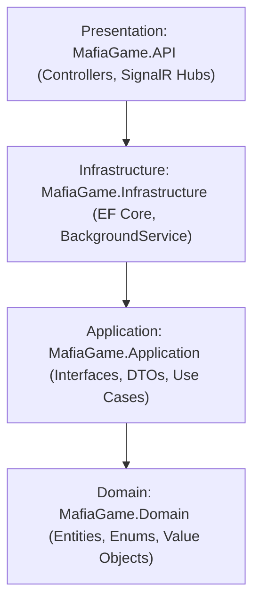

# 🕵️ Real-Time Multiplayer Mafia Game - Clean Architecture Backend


An enterprise-grade, production-ready backend engine for the social deduction game **"Mafia"**, built with **C#, ASP.NET Core Web API, SignalR WebSockets, Entity Framework Core (SQL Server / SQLite), JWT Bearer Authentication**, and an automated **`BackgroundService` Game Loop engine**.

Designed as a flagship software engineering portfolio project demonstrating **Clean Architecture**, connection resiliency with a **60-second disconnection grace period**, dynamic **leaderboard metrics**, and automated **xUnit test suites**.

---

## 🏛️ Clean Architecture Overview



---

## ✨ Key Backend Features

1. **SignalR Connection Resiliency & Grace Period**:
   - Handles mid-game disconnections gracefully in `GameHub.cs`.
   - Starts a 60-second cancellation timer (`IGracePeriodManager`). If the player fails to reconnect within 60 seconds, they are removed from the room and penalized with a **"Bad Point"** on the database leaderboard.

2. **Real-Time Live Vote Trail Stream**:
   - Broadcasts real-time vote trails (`Voter -> Target`) to `Clients.Group(roomCode)`.
   - Supports the **"Blind Voting"** room modifier by masking voter identity as `Anonymous`.

3. **Hosted Worker Game Loop (`BackgroundService`)**:
   - `GameLoopBackgroundService` ticks every 2 seconds to monitor active room timers (`PhaseEndTime <= DateTime.UtcNow`).
   - Automatically processes **Midnight Executions**, evaluates Third-Party roles (**Serial Killer** night kills & **Jester** execution win triggers), and advances phases without blocking main HTTP request threads.

4. **Computed Leaderboard Statistics**:
   - SQL EF Core dynamic metrics tracking Win Rate, Best Decision Makers, and Reliability Scores:
   $$\text{Win Rate (\%)} = \left(\frac{\text{GamesWon}}{\text{GamesPlayed}}\right) \times 100$$
   $$\text{Reliability Score (\%)} = \max\left(0, 100 - \left(\frac{\text{BadPoints}}{\text{GamesPlayed}} \times 20\right)\right)$$

---

## 🌐 Production Cloud Deployment (Launching Live on the Internet)

To host this app online for free so anyone in the world can open it on their phone:

### Option A: Render.com / Railway.app / Fly.io (Docker)
1. Push this repository to **GitHub**.
2. Connect your GitHub repository to [Render.com](https://render.com) or [Railway.app](https://railway.app).
3. Select **Docker** deployment. It will automatically build the `Dockerfile` and give you a free production HTTPS URL like `https://mafia-game-backend.onrender.com`!

### Option B: Azure App Service (Free Tier)
1. In VS Code, install the **Azure App Service** extension.
2. Right-click `MafiaGame.API.csproj` -> **Deploy to Web App...**
3. Select ASP.NET Core .NET 10 environment for instant deployment.

---

## ⚡ Quickstart Guide (Local Execution)

```bash
# 1. Clone & Restore Dependencies
git clone https://github.com/your-username/MafiaGameBackend.git
cd MafiaGameBackend
dotnet restore

# 2. Run Automated xUnit Tests
dotnet test

# 3. Launch ASP.NET Core Web API Server
dotnet run --project src/MafiaGame.API/MafiaGame.API.csproj
```

Open Swagger OpenAPI UI: `http://localhost:5019/swagger`  
Open Web Dashboard: `http://localhost:5019`
